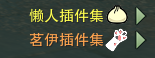
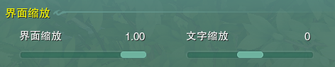
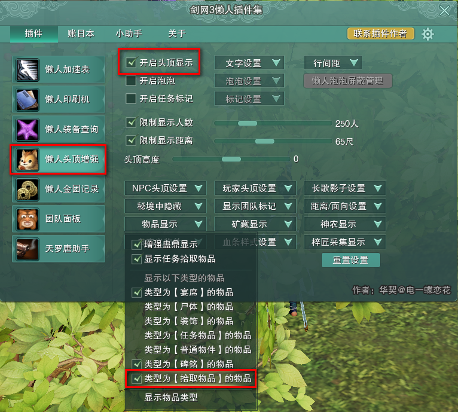
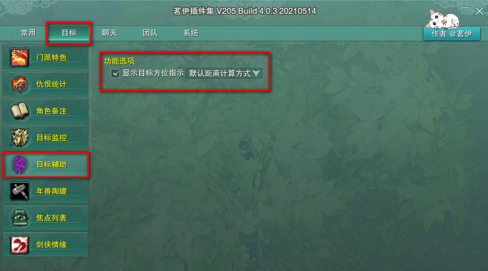
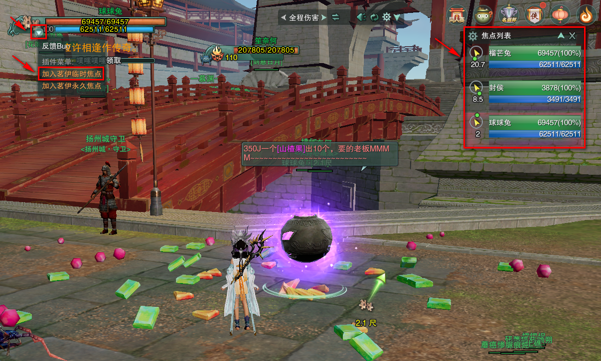

## 《剑网三》AI自动学习做山楂果

你可以点这里下载1 [自动剑网三山楂果.exe](#)

你可以点这里下载2 [自动剑网三山楂果.exe](https://wwa.lanzoui.com/itIyHpli9qj) （已经可以下载）0:29 2021/5/30

### 关于
+ 基于像素的识别，所以需要以上设置完全一样其余随意。

+ 基于虚拟驱动按键，所以只能单开前台理论上不会封号。

### 游戏设置
 - 系统ESC > 效果性能设置 > 窗口设置 > 窗口模式最大化(勾选) 并且 分辨率选1920X1080
 - 系统ESC > 游戏设置 > 界面缩放:1.0 并且 文字缩放:0
 - 懒人插件 > 懒人头顶增强 > 开启头顶显示(勾选) > 物品显示 > 类型为【拾取物品】的物品(勾选)
 - 茗伊插件 > 目标 > 目标辅助 > 显示目标方位指示(勾选)

### 如果不能使用
 - 操作系统必须为64位 
 - win10操作系统缩放与布局必须100% 并且 显示分辨率:1920X1080
 
### 详情使用说明
 > # 需要使用茗伊插件和懒人插件，确保设置和下图一样 
 
  
  
  

 > # 把【球球兔】【榴芒兔】【封侯】依次加入茗伊临时焦点（建议在扬州，图中的球球兔位置最佳） 
 > 扬州漆球球兔的位置在最靠近河的边上！
  
 
 > # 把懒人插件的 类型为【拾取物品】的物品(勾选)，勾选后会出现紫色的文字名字
  
 
 > # 把茗伊插件的 显示目标方位指示(勾选)，勾选后会显示方向和距离
  
